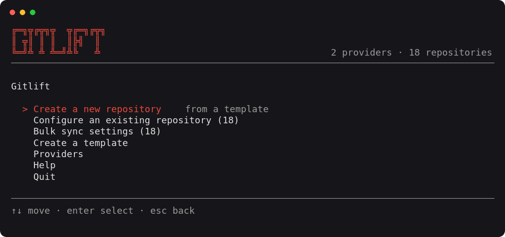

# gitlift

A single binary that applies a YAML template to a git forge. Create a repository with the settings, branch rules, Actions permissions and CI/CD variables you always use, or push those settings onto repositories that already exist, one at a time or in bulk.

Works against GitHub, GitHub Enterprise, GitLab.com and self-hosted GitLab. Everything happens in a full-screen terminal interface. There are no subcommands to memorise.



**You never have to write YAML by hand.** The interface writes the provider file for you on first run, and the *Create a template* flow writes templates, either from scratch, or by reading an existing repository and turning its current settings into a template. The file formats are documented further down for when you want to edit one directly.

## Install

```sh
go install github.com/spaaleks/gitlift/cmd/gitlift@latest
```

Or build from a checkout:

```sh
bin/build-binary.sh             # ./dist/gitlift
bin/build-binary.sh --out ~/.local/bin/gitlift
make install                    # $GOBIN/gitlift
```

## Configure

gitlift reads a provider list from the first of these that exists:

1. `$GITLIFT_CONFIG`
2. `./.gitlift.yaml`
3. `./.providers.yaml`
4. `~/.config/gitlift/providers.yaml`

`gitlift --init` writes a starter file, and the interface offers to write one on first run. Pick that and fill in your tokens rather than starting from a blank file.

```yaml
providers:
    - name: "GitHub"
      type: "github"
      auth:
          token_env: "GITHUB_TOKEN"

    - name: "Work GitLab"
      type: "gitlab"
      auth:
          token: "${WORK_GITLAB_TOKEN}"
          base_url: "https://gitlab.example.com"
```

A token can be inlined, read from an environment variable with `token_env`, or written as `${VAR}`. `base_url` is optional: GitLab URLs may stop at the host and the `/api/v4` suffix is added for you, and a GitHub Enterprise host gets `/api/v3`.

A provider that cannot be used (no token, an unknown type, a rejected credential) is listed on the Providers screen with the reason. It never stops the other providers from loading.

### Token scopes

| Provider | Needs                                                                                                                                                               |
| -------- | ------------------------------------------------------------------------------------------------------------------------------------------------------------------- |
| GitHub   | `repo` (create and configure), `admin:repo_hook` is not required. For Actions settings and secrets the token must have repository administration and secrets write. |
| GitLab   | `api`, and at least Maintainer on the projects you configure.                                                                                                       |

Settings a token cannot reach are reported as skipped, with the missing right named. The run continues.

## What the flows do

**Create a new repository.** Pick a provider and a template, fill in one form, review, apply. The namespace is a left/right selection, not a text field: gitlift fetches your GitHub organisations and GitLab groups in the background at startup and offers them with your personal namespace first, so you cannot type one that does not exist. On GitHub the owner type is taken from whichever entry you pick, so there is no separate user/org question. The name is checked against the chosen namespace before anything is created, so a collision comes back as a form error rather than a failed run. If the fetch fails, the field falls back to plain typing.

**Configure an existing repository.** Apply a template to a repository that is already there. The form is prefilled from the template and marks every field where the repository differs today.

**Create a template.** Author a new template without writing YAML by hand, from a repository, from scratch, or by copying another template. See [Templates](#templates) below.

**Bulk sync settings.** Push features, branch and tag rules, merge settings and CI settings onto many repositories at once. Descriptions, visibility, CI/CD variables, webhooks and integrations are never touched in bulk, because those carry per-repository identity or credentials. One repository that fails does not stop the batch.

Before the review you get a form of the template's feature toggles, and what you set there is applied to every selected repository. Select exactly one and the form also notes where that repository differs today. A template that declares no features has nothing to edit, so it goes straight to review. The review screen offers `e` whenever there is a form behind it and stays silent when there is not.

Branch and tag rules are applied in one of two modes, asked once:

- **append**. Add or update the template's rules, leave any others alone
- **replace**. The template becomes the only rules. On GitHub other rulesets are deleted, on GitLab other protected branches and tags are unprotected

### How a branch rule is applied on GitLab

A rule that is already in place is changed with a `PATCH`, not deleted and rebuilt. That matters for two reasons: the branch is never briefly unprotected mid-run, and the per-user and per-group allowances added by hand in the web interface survive, because gitlift only ever manages the plain role row. A rule that already matches the template causes no write at all.

Changing an access level in place is a paid GitLab feature, and older instances have no `PATCH` at all. When it is refused, gitlift falls back to recreating the rule and says so. If the rule had per-user or per-group rows, that is reported as a skip rather than a success, because those rows are gone.

`push_access` and `merge_access` are separate keys. Declaring only one leaves the other at GitLab's own default rather than copying the value across.

The access names map to GitLab's levels as `no_one` = 0, `developers` = 30, `maintainers` = 40, `admins` = 60. Only those four are accepted on a protected branch or tag. Note that `admins` means _instance_ administrators, so on GitLab.com it is effectively nobody, and `maintainers` is almost always what a template wants.

A rule gitlift cannot update in place is only ever deleted and rebuilt when the in-place update was impossible (no `PATCH` endpoint, or a paid-tier access-level change). A rejected request leaves the rule untouched, and if a rebuild is attempted and its replacement is refused, the previous rule is restored.

## Startup

The menu appears immediately, and repositories are fetched in the background and the two counts fill in when the providers answer. Choosing a flow that needs the list before it has arrived waits for it rather than showing an empty picker.

## When a step is skipped

Every step reports as applied (`✓`), skipped (`⚠`) or failed (`✗`), and a skip always names its reason. gitlift degrades instead of aborting:

- Rulesets are unavailable on a private repository on a free plan. gitlift falls back to classic branch protection for literal branch names, and reports glob patterns like `dev-*` as skipped because classic protection cannot express them.
- A branch that does not exist yet cannot be protected classically. That is reported, not failed. Push the branch and re-run.
- A ruleset GitHub rejects because of the merge-method restriction is retried without it, and the partial result is reported.
- Fork PR approval is not configurable on private repositories, and outside access is not configurable on public ones. Both are skipped with that reason.
- A token without the secrets scope skips the secrets and still writes the plain variables.
- Merge request approvals, per-branch approval rules and code-owner approval are GitLab Premium. On a free instance they are skipped with that reason, and the rest of the merge settings still apply.
- A GitLab integration name the instance does not offer is skipped, not failed. the name is passed through as the API slug, so `slack`, `jira`, `microsoft-teams` and the rest all work without gitlift knowing about them.
- GitHub has no counterpart for `pipelines:` or `integrations:`, and GitLab has none for `actions:`. Each is reported as ignored on the other provider rather than silently dropped.
- GitLab accepts a project update and quietly drops any field its version or tier does not know. After writing `repo.features`, gitlift reads the project back and reports every toggle that came back unchanged, so a setting that did not take is a visible skip rather than a silent success.

## Templates

Templates are YAML files. Three are compiled into the binary, and more are read from, in ascending priority:

1. builtins
2. `~/.config/gitlift/templates`
3. `./templates`
4. `$GITLIFT_TEMPLATES`

A template with the same `name` shadows the lower-priority one, so you can copy a builtin and edit it. `gitlift --paths` prints the search order and marks what exists.

**A template only ever touches what it declares.** A key that is absent is never prompted for and never sent to the provider. Applying to an existing repository leaves anything the template is silent about exactly as it is.

### Building one in the menu

*Create a template* on the main menu writes the YAML for you, from one of three starting points:

- **from an existing repository**. gitlift reads the project's current settings and writes them out as a template. Features, visibility, default branch, topics, branch rules, tag rules, merge settings and (on GitLab) pipeline settings all come across. Webhooks, integrations, Actions settings and CI/CD variables are deliberately left out, because they carry secrets.
- **from scratch**. Every toggle the chosen provider supports, set to what a repository normally has, so you switch things off rather than on.
- **from another template**. Copy a builtin or a custom one under a new name.

A form then lets you set the name, description, visibility and every toggle before it is written. The directories offered are exactly the ones gitlift searches, in the same order, so anything you save is loaded straight back. The first is the default. `gitlift --paths` prints them and marks which exist. The file is named after the template, and gitlift refuses to overwrite one that is already there. The new template is in the list immediately, with no restart.

In a container, set `GITLIFT_TEMPLATES` to a mounted path. It is searched last, so it wins over the others when two templates share a name, and it becomes the default place new templates are written. Otherwise they would land in `$HOME/.config/gitlift/templates` inside the container and disappear with it.

The optional **folder** groups templates. A template one level below a search directory takes that folder's name as its group, and a template sitting directly in a search directory is grouped as `custom`, and compiled-in ones are `builtin`. The group is shown beside every template in the picker, and typing it filters the list, so `work` finds everything under `templates/work/`. Copying a template prefills the folder with the one it came from.

### Writing one by hand

Everything the menu writes can also be typed directly. This is the full format.

```yaml
name: "GitHub base"
description: "Default GitHub repository settings"

repo:
    visibility: "private"
    description: ""
    default_branch: "main"
    topics: ["go", "cli"]
    features:
        issues: true
        wiki: false
        projects: true

branch_rules:
    rules:
        - name: "main"
          patterns: ["main"]
          allow_force_push: false
          push_access: "no_one"
          merge_access: "maintainers"
          unprotect_access: "maintainers"
          code_owner_approval: true
          required_approvals: 1
          merge_methods: ["merge"]

tag_rules:
    rules:
        - name: "releases"
          patterns: ["v*"]
          create_access: "maintainers"

merge_requests:
    merge_method: "merge"
    squash: "default_on"
    delete_source_branch: true
    pipeline_must_succeed: true
    all_threads_resolved: true
    skipped_pipeline_allowed: false
    approvals_required: 2
    reset_approvals_on_push: true
    author_may_approve: false
    committer_may_approve: false
    allow_auto_merge: true

actions:
    fork_pr_approval: "all_external_contributors"
    outside_access: "none"
    default_workflow_permissions: "read"
    can_approve_pull_requests: false

pipelines:
    auto_devops: false
    auto_cancel_pending: true
    public_pipelines: false
    git_strategy: "fetch"
    git_depth: 20
    timeout: "1h"
    config_path: ".gitlab-ci.yml"
    forward_deployment: true
    separated_caches: true
    allow_fork_pipelines: false
    shared_runners: true
    group_runners: true
    restrict_job_token_scope: true

webhooks:
    - url: "https://example.com/hook"
      secret: ""
      events: ["push", "merge_request", "pipeline"]
      ssl_verification: true
      push_branch_filter: "main"
      content_type: "json"

integrations:
    - name: "slack"
      enabled: true
      events: ["push", "pipeline"]
      settings:
          webhook: "https://hooks.slack.com/services/…"
          notify_only_broken_pipelines: true

ci_cd_variables:
    - key: "DOCKERHUB_USER"
      value: "someone"
      visibility: "all"
    - key: "DOCKERHUB_PASSWORD"
      value: ""
      visibility: "private"
    - key: "GITLAB_ONLY"
      value: "x"
      masked: true
      protected: false
      raw: false
      type: "env_var"
      environment_scope: "production"
      description: "used by the deploy job"

providers:
    github:
        context:
            owner: ""
            owner_type: "user"
        repo:
            features:
                projects: true
    gitlab:
        context:
            namespace: ""
```

#### Key reference

Every block is optional, and so is every key inside it. A key a provider has no equivalent for is reported as ignored rather than sent.

| Key                                        | Applies to             | Values and notes                                                                                |
| ------------------------------------------ | ---------------------- | ----------------------------------------------------------------------------------------------- |
| `repo.visibility`                          | both                   | `private`, `internal`, `public`                                                                 |
| `repo.features`                            | both                   | booleans, see the feature table below for which side has which                                  |
| `branch_rules.rules[].name`                | both                   | the ruleset name, and the identity used when re-applying                                        |
| `branch_rules.rules[].patterns`            | both                   | bare names become `refs/heads/<name>` on GitHub                                                 |
| `branch_rules.rules[].push_access`         | GitLab                 | `no_one`, `developers`, `maintainers`, `admins`                                                 |
| `branch_rules.rules[].merge_access`        | GitLab                 | same four                                                                                       |
| `branch_rules.rules[].unprotect_access`    | GitLab                 | same four                                                                                       |
| `branch_rules.rules[].code_owner_approval` | GitLab Premium, GitHub |                                                                                                 |
| `branch_rules.rules[].required_approvals`  | both                   | GitLab needs Premium                                                                            |
| `branch_rules.rules[].merge_methods`       | GitHub                 | `merge`, `squash`, `rebase`, see below                                                          |
| `tag_rules.rules[].create_access`          | GitLab                 | `no_one`, `developers`, `maintainers`, `admins`                                                 |
| `merge_requests`                           | both                   | GitLab: Settings → Merge requests                                                               |
| `merge_requests.merge_method`              | both                   | `merge`, `rebase`, `fast_forward`                                                               |
| `merge_requests.squash`                    | both                   | `never`, `default_off`, `default_on`, `always`                                                  |
| `merge_requests.pipeline_must_succeed`     | GitLab                 |                                                                                                 |
| `merge_requests.all_threads_resolved`      | GitLab                 |                                                                                                 |
| `merge_requests.skipped_pipeline_allowed`  | GitLab                 |                                                                                                 |
| `merge_requests.approvals_required`        | GitLab Premium         |                                                                                                 |
| `merge_requests.reset_approvals_on_push`   | GitLab Premium         |                                                                                                 |
| `merge_requests.author_may_approve`        | GitLab Premium         |                                                                                                 |
| `merge_requests.committer_may_approve`     | GitLab Premium         |                                                                                                 |
| `merge_requests.allow_auto_merge`          | GitHub                 |                                                                                                 |
| `actions`                                  | GitHub                 |                                                                                                 |
| `actions.fork_pr_approval`                 | GitHub                 | `first_time_contributors_new_to_github`, `first_time_contributors`, `all_external_contributors` |
| `actions.outside_access`                   | GitHub                 | `none`, `user`, `organization`, private repositories only                                       |
| `actions.default_workflow_permissions`     | GitHub                 | `read`, `write`                                                                                 |
| `pipelines`                                | GitLab                 | Settings → CI/CD                                                                                |
| `pipelines.git_strategy`                   | GitLab                 | `clone`, `fetch`                                                                                |
| `pipelines.timeout`                        | GitLab                 | a duration such as `1h30m`, or a plain number of seconds                                        |
| `webhooks`                                 | both                   | keyed by url, re-applying updates the hook and never adds a second                              |
| `webhooks[].events`                        | both                   | see the webhook event table below                                                               |
| `webhooks[].push_branch_filter`            | GitLab                 |                                                                                                 |
| `webhooks[].content_type`                  | GitHub                 |                                                                                                 |
| `integrations`                             | GitLab                 | `settings` is passed straight through to the integration                                        |
| `ci_cd_variables[].visibility`             | GitHub                 | `private` makes it an encrypted secret. `all`, `selected`                                       |
| `ci_cd_variables[].masked`                 | GitLab                 |                                                                                                 |
| `ci_cd_variables[].protected`              | GitLab                 |                                                                                                 |
| `ci_cd_variables[].raw`                    | GitLab                 |                                                                                                 |
| `ci_cd_variables[].type`                   | GitLab                 | `env_var`, `file`                                                                               |
| `ci_cd_variables[].environment_scope`      | GitLab                 | `*` when omitted                                                                                |
| `ci_cd_variables[].description`            | GitLab                 |                                                                                                 |
| `providers`                                | both                   | optional per-provider overrides                                                                 |
| `providers.github.context.owner_type`      | GitHub                 | `user`, `org`                                                                                   |

Overrides deep-merge over the root values: maps merge key by key, arrays are replaced wholesale. If a `providers:` block exists, the template is only offered for the providers it names.

`merge_methods` is the only way GitHub can restrict merge methods per branch, and it works by adding the ruleset's `pull_request` rule, which also means that branch can then only be changed through a PR. Omit the key to keep direct pushes. GitLab's merge method is project-wide, so the key is reported as ignored there and `merge_requests.merge_method` is used instead.

#### Feature toggles

`repo.features` decides which parts of a repository exist at all. A key a provider does not have is reported as ignored and never sent.

| Key                               | GitHub | GitLab |
| --------------------------------- | ------ | ------ |
| `issues`                          | ✓      | ✓      |
| `merge_requests`                  |        | ✓      |
| `requirements`                    |        | ✓      |
| `wiki`                            | ✓      | ✓      |
| `projects`                        | ✓      |        |
| `discussions`                     | ✓      |        |
| `repository`                      |        | ✓      |
| `forking`                         | ✓      | ✓      |
| `snippets`                        |        | ✓      |
| `downloads`                       | ✓      |        |
| `template`                        | ✓      |        |
| `web_commit_signoff`              | ✓      |        |
| `builds`                          |        | ✓      |
| `security_and_compliance`         |        | ✓      |
| `advanced_security`               | ✓      |        |
| `secret_scanning`                 | ✓      |        |
| `secret_scanning_push_protection` | ✓      |        |
| `dependabot_alerts`               | ✓      |        |
| `dependabot_security_updates`     | ✓      |        |
| `releases`                        |        | ✓      |
| `packages`                        |        | ✓      |
| `container_registry`              |        | ✓      |
| `feature_flags`                   |        | ✓      |
| `pages`                           |        | ✓      |
| `model_registry`                  |        | ✓      |
| `model_experiments`               |        | ✓      |
| `environments`                    |        | ✓      |
| `infrastructure`                  |        | ✓      |
| `monitor`                         |        | ✓      |
| `analytics`                       |        | ✓      |
| `duo`                             |        | ✓      |
| `service_desk`                    |        | ✓      |
| `request_access`                  |        | ✓      |
| `lfs`                             |        | ✓      |

#### GitLab Duo

`duo` is the master switch for Settings, General, GitLab Duo. It is the one setting gitlift does not send over REST, because the project API has no field for it. It goes through the `projectSettingsUpdate` GraphQL mutation at `/api/graphql` instead, derived from the same base URL and the same token.

The mutation reports the value it ended up with, so a change that a group or instance policy overrides is a skip that names the reason rather than a false success. If a GitLab version does not accept the field, the GraphQL error is passed through verbatim.

Turning Duo off across a whole instance is an Application Settings call and needs an administrator, which is outside what gitlift does.

Full request and response detail for anything that failed goes to the log file, whose path is on the Providers screen and in `gitlift --paths`.

A step that changed many things lists them underneath rather than crushing them into one line:

```
  ✓ settings: project settings (23)
      · issues=true
      · merge_requests=true
      · wiki=false
      …
  ✓ branch rules: core-branches → main  protected
```

#### Webhook events

Events are written once and translated per provider:

| Template        | GitHub          | GitLab                  |
| --------------- | --------------- | ----------------------- |
| `push`          | `push`          | `push_events`           |
| `tag_push`      | `create`        | `tag_push_events`       |
| `issues`        | `issues`        | `issues_events`         |
| `merge_request` | `pull_request`  | `merge_requests_events` |
| `note`          | `issue_comment` | `note_events`           |
| `pipeline`      | `workflow_run`  | `pipeline_events`       |
| `job`           | `workflow_job`  | `job_events`            |
| `wiki_page`     | `gollum`        | `wiki_page_events`      |
| `release`       | `release`       | `releases_events`       |
| `deployment`    | `deployment`    | `deployment_events`     |

A hook is identified by its URL, so re-applying a template updates the existing hook instead of adding a second one. Events the template does not list are switched off, so the hook ends up matching the template exactly.

## License

MIT. See [LICENSE](LICENSE).
